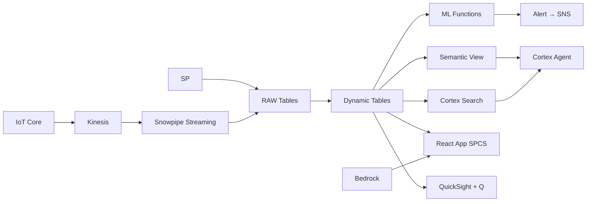

# Equipment Predictive Maintenance

Predict semiconductor tool failures 72 hours before they occur — IoT sensors stream to Snowflake, ML.FORECAST identifies degradation patterns, and alerts trigger before costly unplanned downtime.

## Architecture

Malaysia's semiconductor fabs operate 120 critical tools worth RM 2 billion in capital equipment. Unplanned downtime costs RM 12M annually — a single lithography tool failure halts an entire production line for 48+ hours. Traditional time-based maintenance either replaces parts too early (wasting RM 3M in premature replacements) or too late (causing cascading failures). The Maintenance Director needs prediction, not reaction.



## Snowflake Capabilities

| Capability | Implementation |
|-----------|---------------|
| Dynamic Tables | EQUIPMENT_HEALTH_SCORE / SENSOR_DRIFT_DETECTION / REMAINING_USEFUL_LIFE / MAINTENANCE_BACKLOG |
| ML Functions | ML.FORECAST + ML.ANOMALY_DETECTION |
| Cortex AI | COMPLETE, AI_CLASSIFY, SUMMARIZE |
| Cortex Search | 100 documents indexed |
| Cortex Agent | MAINTENANCE_INTELLIGENCE_AGENT |
| Semantic View | MAINTENANCE_ANALYTICS |
| React App (SPCS) | 5 tabs + DemoGuide |


## AWS Services

| Service | Role in Demo |
|---------|-------------|
| AWS IoT Core | Ingest equipment sensor telemetry from 120 tools (1M readings) |
| Amazon Kinesis | Stream real-time sensor data for processing |
| Amazon SNS | Alert notification for predicted failures and critical drift |
| Amazon Bedrock (Claude) | Generate root cause analysis and corrective action recommendations |
| Amazon QuickSight + Q | Maintenance dashboard with natural language equipment queries |


## Personas

| Persona | Role | Key Questions |
|---------|------|---------------|
| **Rajesh Kumar** | Maintenance Director | "Which tools are predicted to fail this week?" "What's our total unplanned downtime cost this quarter?" |
| **Wong Mei Ling** | Equipment Engineer | "Show me the degradation trend for EQ-0023." "Which sensors are drifting beyond spec?" |


## Data

| Table | Rows | Description |
|-------|------|-------------|
| EQUIPMENT | 120 | Critical semiconductor manufacturing tools (lithography, etch, CVD, implant) |
| TELEMETRY | 1,000,000 | IoT sensor readings — vibration, temperature, pressure, RF power, flow rate |
| WORK_ORDERS | 3,000 | Preventive and corrective maintenance work orders |
| SPARE_PARTS | 500 | Spare parts inventory with lead times and criticality ratings |
| MAINTENANCE_DOCS | 100 | Equipment manuals, failure mode guides, corrective action procedures |
| DOWNTIME_EVENTS | 800 | Historical unplanned downtime events with root cause and cost |


## Build Instructions

### Prerequisites
- Snowflake account with ACCOUNTADMIN access
- Cortex AI enabled (ML Functions, Search, Agent)
- Warehouse: SEMI_WH (Medium)
- AWS CLI with access (us-west-2)

### Deployment

```bash
snowsql -f snowflake/00_setup.sql
snowsql -f snowflake/01_marketplace_install.sql
snowsql -f snowflake/02_raw_tables.sql
snowsql -f snowflake/03_staging.sql
snowsql -f snowflake/04_dynamic_tables.sql
snowsql -f snowflake/05_search.sql
snowsql -f snowflake/06_ml_models.sql
snowsql -f snowflake/07_semantic_view.sql
snowsql -f snowflake/08_agent.sql
```

### React App (SPCS)
```bash
cd app && npm ci && npm run build
docker build -t aws-malaysia-semiconductor-maintenance-app .
docker push bdiqc8sm-default.registry.snowflakecomputing.com/semiconductor_maintenance/app/aws_malaysia_semiconductor_maintenance/app:latest
```

### Demo Mode
Open the app URL with `?demo=true` for presenter view.

## Build Modes

### Snowflake Only
Run scripts 00-08 (skip AWS-specific integration). Uses:
- **Snowpipe Streaming SDK** instead of AWS IoT Core
- **Snowpipe Streaming SDK (direct)** instead of Amazon Kinesis
- **Alerts + Notification Integration** instead of Amazon SNS
- **Cortex Complete** instead of Amazon Bedrock (Claude)
- **Snowflake Intelligence (Cortex Analyst)** instead of Amazon QuickSight + Q

### Full AWS + Snowflake
Run all scripts including AWS integration. Deploy QuickSight dashboard from `quicksight/`.

## Business Impact

Industry research and Snowflake customer outcomes:
- **Malaysia semiconductor exports reached RM 450B (US$98B) in 2023, representing 18.4% of GDP** — [MIDA](https://www.mida.gov.my/setting-up-in-malaysia/why-malaysia/)
- **Predictive maintenance in semiconductor fabs reduces unplanned downtime by 30-50%** — [Deloitte Smart Factory](https://www2.deloitte.com/us/en/insights/focus/industry-4-0/smart-factory-connected-manufacturing.html)
- **A single unplanned equipment failure in a semiconductor fab costs $100K-$500K per incident** — [McKinsey Semiconductors](https://www.mckinsey.com/industries/semiconductors/our-insights)
- **Yamaha Motor achieved real-time manufacturing intelligence on Snowflake** — [Snowflake Customers](https://www.snowflake.com/en/customers/all-customers/yamaha-motor/)


## Key Demo Numbers

- **120 critical tools** monitored across Penang/Kulim fabs
- **RM 12M** annual unplanned downtime cost (US$2.8M)
- **72-hour window** failure prediction lead time (ML.FORECAST)
- **8 tools** currently in ALARM state
- **3,000 work orders** tracked (preventive + corrective)
- **100 maintenance docs** indexed and searchable via Cortex Search


## License

Apache 2.0 — See [LICENSE](LICENSE) for details.

This is a personal demo project and is not an official Snowflake offering. It comes with no support or warranty.